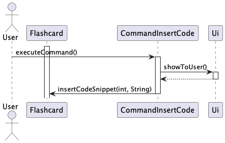
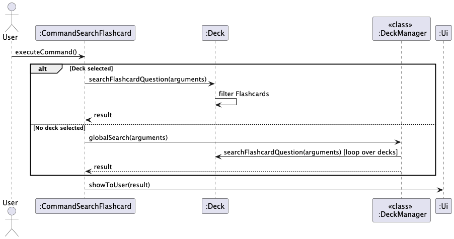
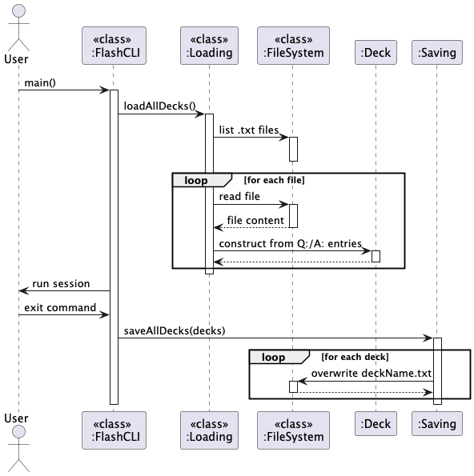

# Developer Guide

## Acknowledgements

{list here sources of all reused/adapted ideas, code, documentation, and third-party libraries -- include links to the original source as well}

## Design & implementation

{Describe the design and implementation of the product. Use UML diagrams and short code snippets where applicable.}

### Edit Flashcard Question and Answer Feature

#### Design

This feature enables the user to edit the question and answer to a specific flashcard by supplying its index and updated question and answer. It assumes the user has already selected a deck.

#### Sequence Diagram


#### Implementation

##### `Deck#editFlashcard(int index, String arguments)`

- Replaces the existing flashcard at index with updated question and answer
- Returns a confirmation of the updated flashcard that was edited

##### `CommandEdit#executeCommand()`

- Parses the index
- Validates that it's a valid number and within bounds
- Replaces and updates the existing flashcard and displays the updated flashcard

**Edge Cases Handled:**
- Invalid index format → `NumberFormatException`
- Out-of-bounds index → `ArrayIndexOutOfBoundsException`

### Insert Code Snippet

#### Design

This feature enables the user to insert a code snippet to a specific flashcard by supplying its index and code snippet. It assumes the user has already selected a deck.

#### Sequence Diagram



#### Implementation

##### `Deck#insertCodeSnippet(int index, String arguments)`

- Formats and adds a code snippet into an existing flashcard
- Returns a confirmation of the updated flashcard with the code snippet

##### `CommandInsertCode#executeCommand()`

- Parses the index
- Validates that it's a valid number and within bounds
- Inserts the provided code snippet into the existing flashcard and displays the updated flashcard with code snippet

**Edge Cases Handled:**
- Invalid index format → `NumberFormatException`
- Out-of-bounds index → `ArrayIndexOutOfBoundsException`


### Search Feature

#### Design

The flashcard application supports searching for flashcards either within the currently selected deck or globally across all decks.

The search feature is designed with the following constraints:

- Users may search by question (`q/`) and/or answer (`a/`)
- If no deck is selected, the search is performed globally across all decks
- If a deck is selected, only that deck is searched
- The system is case-insensitive and supports partial matches

##### Class Diagram

The following PlantUML diagram shows the key classes involved in the search operation:


##### Sequence Diagram

Below is a simplified sequence of how a search request is handled:



#### Implementation

##### `Deck#searchFlashcardQuestion(String arguments)`

This method parses the search arguments for `/q` and `/a` prefixes and returns flashcards that match either (or both) the question or answer. It supports edge cases such as:

- Only `/q` or only `/a` provided
- Input in any order (`a/first q/second` works too)
- Case insensitivity

The method throws a `FlashCLIArgumentException` if neither `/q` nor `/a` is present.

```java
String queryQuestion = ...; // parsed from arguments
String queryAnswer = ...;   // parsed from arguments
for (Flashcard f : flashcards) {
  boolean matches = ...;
  if (matches) matched.add(f);
}
return matched;
```

##### `DeckManager#globalSearch(String arguments)`

This method iterates through all decks in `DeckManager.decks`, calls `deck.searchFlashcardQuestion()`, and returns a formatted string of results including the deck name, question, and answer.

**Edge cases handled:**
- No decks exist → `EmptyListException`
- Malformed arguments → `FlashCLIArgumentException`
- No matches → returns `"No matching flashcards found in any deck."`

##### `CommandSearchFlashcard`

This command bridges user input with search logic:

- If `DeckManager.currentDeck == null`, invokes `DeckManager.globalSearch()`
- Otherwise, calls `Deck.searchFlashcardQuestion()`
- Sends output to `Ui.showToUser(...)`

#### Considerations & Limitations

- Currently does not support regex or fuzzy matching
- Could be extended to highlight matched terms or paginate long results
- Error handling is gracefully propagated to the UI layer

### Save/Load Functionality

#### Design

The Save/Load functionality ensures persistence of flashcard data between sessions. When the program exits, it serializes all in-memory `Deck` objects into individual `.txt` files in the `./data/decks` directory. Upon startup, it reconstructs the decks by reading and parsing these `.txt` files.

This design allows easy access, portability, and simple debugging via text files, avoiding binary or JSON formats for simplicity.

#### Class Diagram


#### Sequence Diagram



#### Implementation

##### `Saving.saveAllDecks(Map<String, Deck>)`

- Creates `./data/decks/` directory if not present  
- Removes any `.txt` files that no longer correspond to in-memory decks  
- Iterates over each deck and writes its flashcards in:

```
Q: question text
A: answer text
```

Each flashcard is separated by a blank line for clarity.

**Edge cases handled:**
- Missing directory → automatically created
- Deleted decks → corresponding `.txt` files removed

##### `Loading.loadAllDecks()`

- Reads all `.txt` files in `./data/decks`
- Infers deck name from filename (e.g. `bio.txt` → deck name = `bio`)
- Parses `Q:` and `A:` pairs into `Flashcard` objects
- Adds each loaded `Deck` to a `LinkedHashMap`

**Edge cases handled:**
- Non-existent or empty folder → returns empty deck map
- Files with missing/partial questions/answers → skipped or handled gracefully

##### `FlashCLI.main()` Integration

```java
DeckManager.decks = Loading.loadAllDecks();
...
Saving.saveAllDecks(DeckManager.decks);
```

- Loads decks at startup  
- Saves them at exit, after user types the `exit` command  

#### Considerations

- File format is human-readable and editable
- Current implementation assumes well-formed files
- Future improvements: introduce backup/restore, encryption, or support for import/export formats like JSON/CSV

### Delete Flashcard Feature

#### Design

The delete flashcard feature allows users to remove a specific flashcard from the currently selected deck based on a 0-based index. The system validates the index and ensures it’s within bounds.

#### Class Diagram


#### Sequence Diagram


#### Implementation

##### `Deck#deleteFlashcard(int index)`

- Removes the flashcard at the given index
- Returns a confirmation message with the deleted flashcard's content

##### `CommandDelete#executeCommand()`

- Parses the index from user input
- Validates it as a number and within bounds
- Invokes `deleteFlashcard(...)`
- Displays confirmation or appropriate error messages

**Edge Cases Handled:**
- Invalid input format (e.g., not an integer) → `NumberFormatException`
- Index out of bounds → `ArrayIndexOutOfBoundsException`

### View Flashcard Answer Feature

#### Design

This feature enables the user to view the answer to a specific flashcard by supplying its index. It assumes the user has already selected a deck.

#### Class Diagram


#### Sequence Diagram


#### Implementation

##### `Deck#viewFlashcardAnswer(int index)`

- Returns the answer text of the flashcard at the given index

##### `CommandViewAnswer#executeCommand()`

- Parses the index
- Validates that it's a valid number and within bounds
- Retrieves and displays the answer

**Edge Cases Handled:**
- Invalid index format → `NumberFormatException`
- Out-of-bounds index → `ArrayIndexOutOfBoundsException`

## Product scope
### Target user profile

The user should:
- be a CS2113 student
- prefer desktop apps over other types
- prefers typing to mouse interactions
- is reasonably comfortable using CLI apps

### Value proposition

This app provides a no-frills solution to helping CS2113 students study and 
practice using terminal commands while memorising key information required for the course.

## User Stories

|Version| As a ... | I want to ... | So that I can ...|
|--------|----------|---------------|------------------|
|v1.0|new user|see usage instructions|refer to them when I forget how to use the application|
|v2.0|user|find a to-do item by name|locate a to-do without having to go through the entire list|

## Non-Functional Requirements
1. Should be compatible on any mainstream OS as long as it has Java 17 or above installed. 
2. The system should respond to user input within 5 seconds for most commands under typical usage.
3. Should be intuitive for most users familiar with a command line user interface .
4. End-users should be able to set up and run the flashcard quizzes within 3 steps (create deck, add flashcard, quiz).
5. The system has automated logging after the end of every session, and be able to store up to a casual amount of usage.


## Glossary

* *glossary item* - Definition

## Instructions for manual testing

{Give instructions on how to do a manual product testing e.g., how to load sample data to be used for testing}
